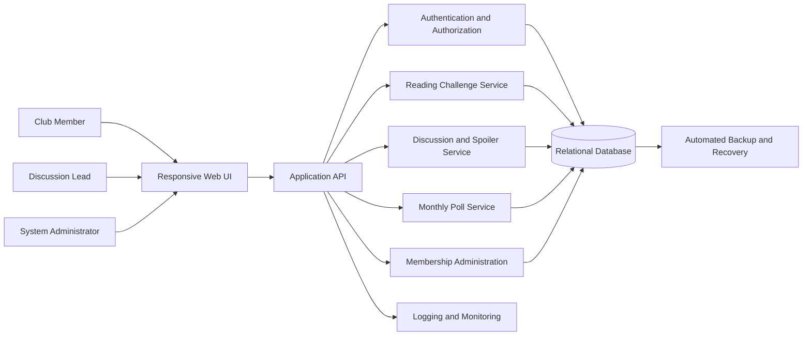

# Architecture Overview

## Architectural style

The portal uses a layered, modular service architecture. This is appropriate for a small project because it keeps deployment simple while separating the main business capabilities. Each module can be tested independently and extracted into a separate service later if scale requires it.

## Logical view

## Component responsibilities

| Component | Responsibility | Related requirements |
|---|---|---|
| Responsive Web UI | Presents goals, progress, discussions, polls, validation messages, and role-appropriate controls. | FR-001 to FR-005 |
| Application API | Provides the controlled entry point, validates requests, and coordinates business transactions. | All |
| Authentication and Authorization | Identifies the user and enforces Club Member, Discussion Lead, and Administrator permissions. | FR-004, FR-005, NFR-001 |
| Reading Challenge Service | Creates and edits goals, records pages or chapters read, and calculates progress. | FR-002, FR-003 |
| Discussion and Spoiler Service | Stores discussion comments and masks spoiler-tagged content until an explicit reveal. | FR-001 |
| Monthly Poll Service | Creates polls, validates candidates and deadlines, records one vote per member, and publishes tallies. | FR-004, FR-005, NFR-001 |
| Membership Administration | Manages club membership and account status. | Supporting use case |
| Relational Database | Persists accounts, goals, progress logs, comments, polls, candidates, and votes. | All, especially NFR-002 |
| Logging and Monitoring | Records operational failures and availability indicators without exposing protected content. | NFR-002 |
| Backup and Recovery | Protects persistent records and supports restart or disaster recovery. | NFR-002 |

## Key data model

- `User` and `Membership` identify actors and roles.
- `ReadingGoal` stores the selected book and target pages or chapters.
- `ReadingProgress` stores dated progress entries.
- `DiscussionThread` and `Comment` store conversations; comments include spoiler metadata.
- `Poll` and `PollCandidate` define each monthly selection.
- `Vote` references one user, one poll, and one candidate. A unique constraint on `(user_id, poll_id)` enforces one vote per member per poll.

## Quality decisions

- **Security:** protected requests require an authenticated identity; role checks are performed in the API rather than only in the interface.
- **Vote integrity:** the unique member-and-poll constraint and an atomic transaction prevent duplicate votes and partial tally updates.
- **Availability:** health monitoring, restart-safe persistence, and scheduled backups support the 99% monthly availability target.
- **Maintainability:** services are separated by business capability and share stable interfaces through the application API.
- **Privacy:** logs use internal identifiers and omit passwords, session tokens, and discussion content.

